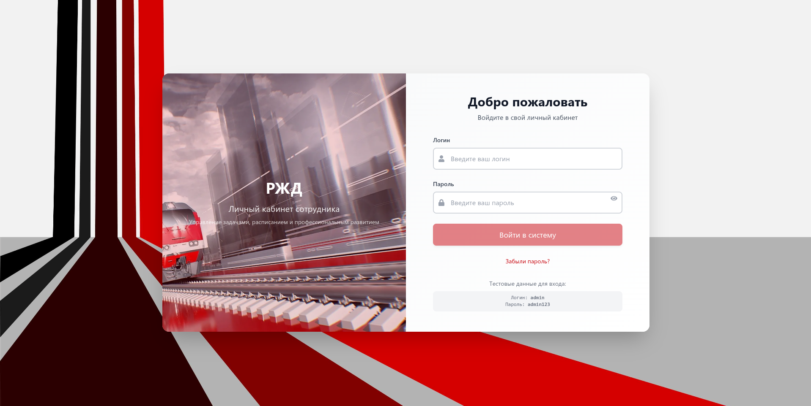
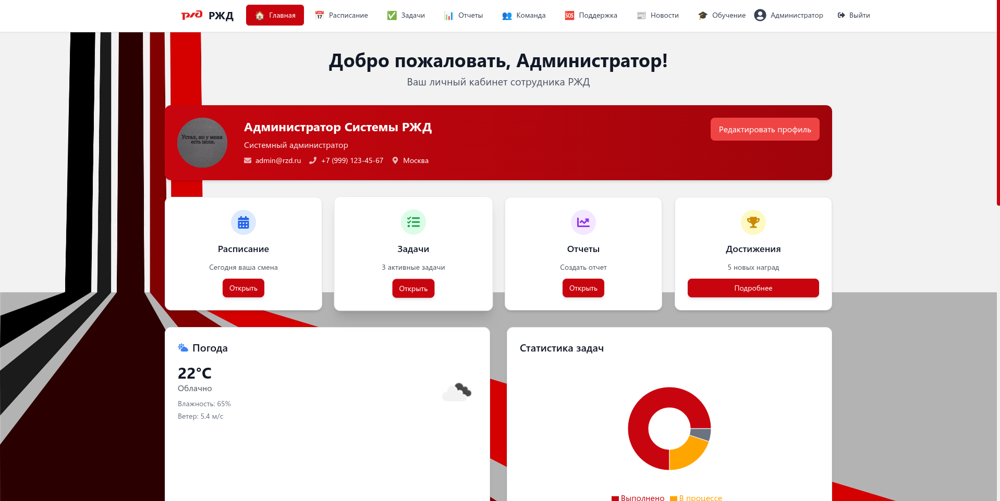
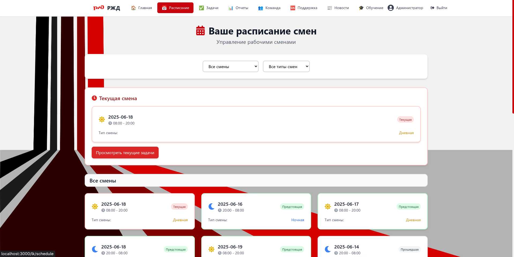
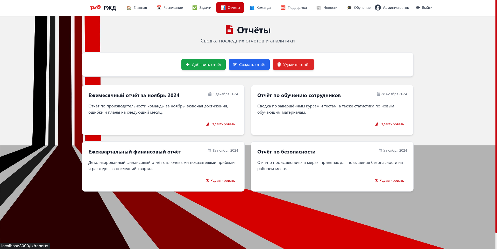
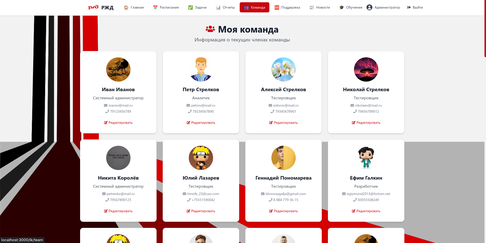
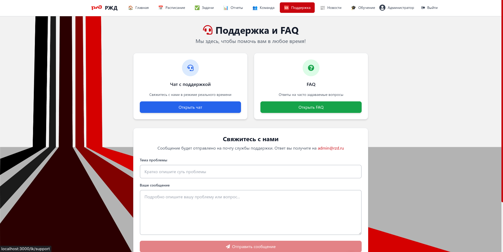
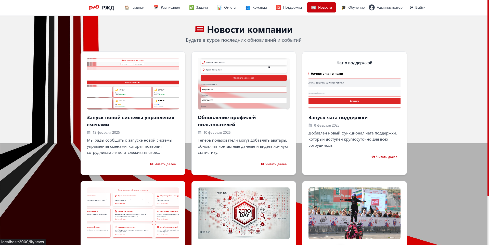
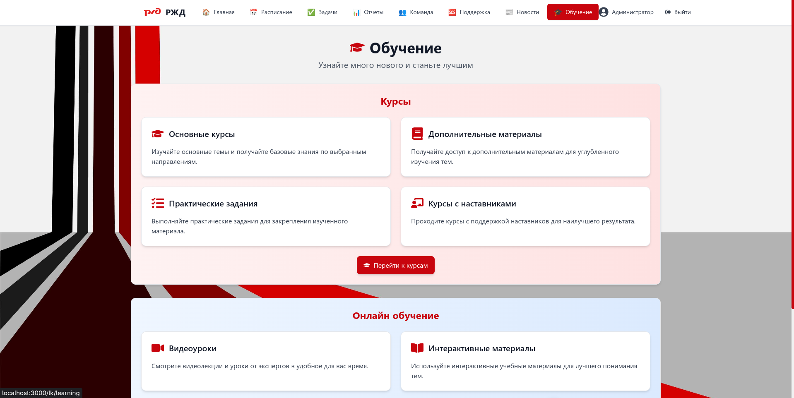
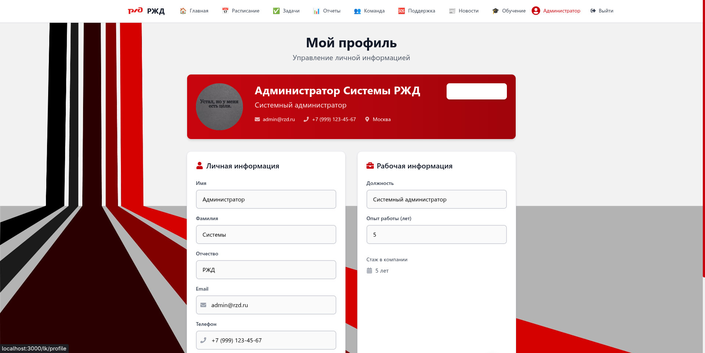

# Система личного кабинета РЖД

Веб-приложение для управления персоналом и рабочими процессами в компании РЖД.

## Технологии

- **Next.js 13** - React фреймворк с App Router
- **TypeScript** - типизированный JavaScript
- **Prisma** - ORM для работы с базой данных
- **SQLite** - база данных
- **Tailwind CSS** - стилизация
- **bcryptjs** - хеширование паролей

## Функциональность

- 🔐 Система аутентификации с хешированием паролей
- 👤 Личный кабинет сотрудника
- 📅 Управление расписанием и сменами
- ✅ Система задач и отчетов
- 👥 Управление командами
- 📚 Обучение и курсы
- 📢 Уведомления
- 🎨 Современный UI/UX

## Установка и запуск

1. **Клонируйте репозиторий:**
```bash
git clone <repository-url>
cd rzd
```

2. **Установите зависимости:**
```bash
npm install
```

3. **Настройте базу данных:**
```bash
# Сгенерируйте Prisma клиент
npm run db:generate

# Примените миграции
npm run db:push

# Заполните базу тестовыми данными
npm run db:seed
```

4. **Запустите сервер разработки:**
```bash
npm run dev
```

5. **Откройте браузер:**
Перейдите по адресу [http://localhost:3000](http://localhost:3000)

## Тестовые данные

После выполнения `npm run db:seed` будет создан тестовый пользователь:
- **Логин:** admin
- **Пароль:** admin123

## Структура проекта

```
rzd/
├── app/                    # Next.js App Router
│   ├── api/               # API маршруты
│   ├── lk/                # Личный кабинет
│   └── components/        # React компоненты
├── lib/                   # Утилиты и конфигурация
├── prisma/                # Схема базы данных
├── public/                # Статические файлы
└── scripts/               # Скрипты инициализации
```

## API Endpoints

- `POST /api/auth` - Авторизация
- `POST /api/register` - Регистрация
- `POST /api/logout` - Выход
- `GET /api/user` - Получение данных пользователя
- `GET /api/notifications` - Уведомления
- `GET /api/shifts` - Смены
- `GET /api/team` - Команды

## Разработка

### Полезные команды

```bash
# Запуск в режиме разработки
npm run dev

# Сборка проекта
npm run build

# Запуск продакшн версии
npm run start

# Линтинг кода
npm run lint

# Сброс базы данных
npm run db:reset
```

### Работа с базой данных

```bash
# Просмотр базы данных
npx prisma studio

# Создание миграции
npx prisma migrate dev --name migration_name

# Применение миграций
npx prisma db push
```

## Безопасность

- Пароли хешируются с помощью bcrypt
- Используются HTTP-only cookies для сессий
- Middleware защищает приватные маршруты
- Валидация данных на сервере


## 🧭 Скриншоты интерфейса

Ниже представлены скриншоты основных экранов портала.

---

### 🔐 1. Авторизация


---

### 🏠 2. Главная страница


---

### 📅 3. Расписание


---

### ✅ 4. Задачи


---

### 📊 5. Отчёты


---

### 👥 6. Команда


---

### 🆘 7. Поддержка


---

### 📰 8. Новости


---

### 🎓 9. Обучение


---

### 👤 10. Профиль / Выход


## Лицензия
MIT License (с уточнением об использовании бренда РЖД)

Copyright (c) 2025 Render

Настоящий проект создан исключительно в учебных и демонстрационных целях.
Он не является официальным продуктом, связанным с ПАО "РЖД" или его дочерними организациями.

Разрешается свободно использовать, копировать, изменять, объединять, публиковать,
распространять, сублицензировать и/или продавать копии данного программного обеспечения,
при соблюдении следующих условий:

1. В приведённой выше заметке об авторских правах и в этом разрешении
   должно сохраняться упоминание об авторе — Render.
2. Использование логотипа, фирменного стиля и товарных знаков ПАО "РЖД"
   допускается только в некоммерческих и учебных целях.
3. Автор не несёт ответственности за любое использование кода,
   связанное с нарушением авторских прав или товарных знаков третьих лиц.

Программное обеспечение предоставляется «как есть» (AS IS),
без каких-либо гарантий, явных или подразумеваемых,
включая, но не ограничиваясь, гарантии товарной пригодности
или пригодности для определённой цели.
Автор ни при каких обстоятельствах не несёт ответственности
по любым претензиям, убыткам или другим обязательствам,
возникающим из использования программы.

© 2025 — Демо-проект интерфейса РЖД  
Разработчик: **Render**