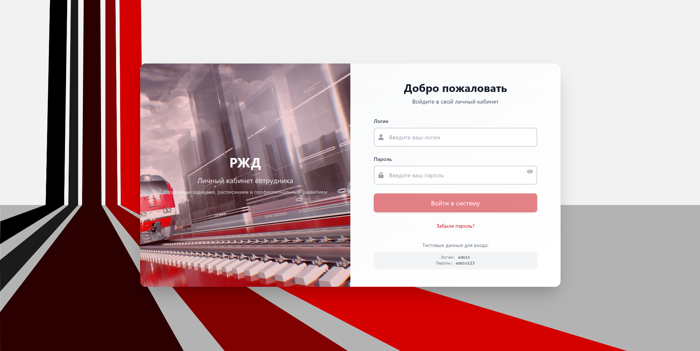
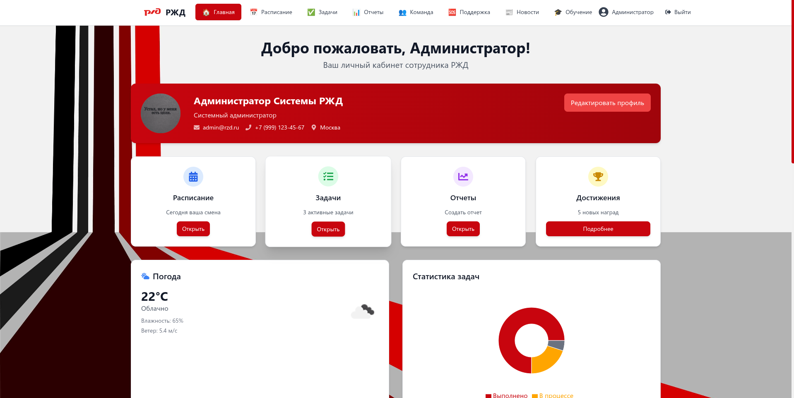
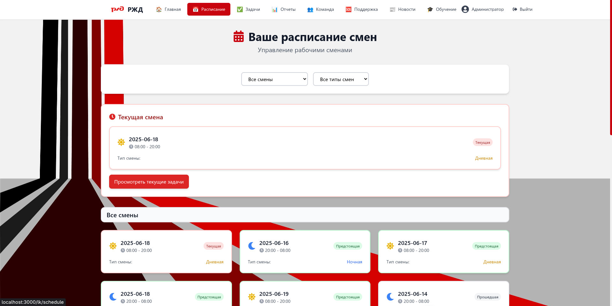
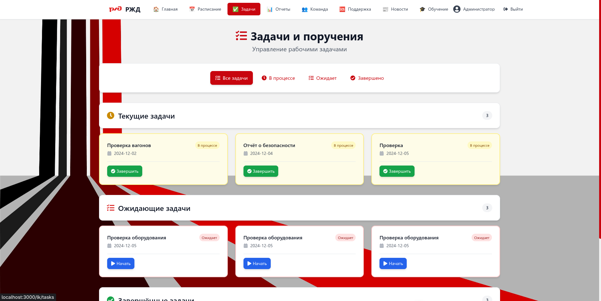
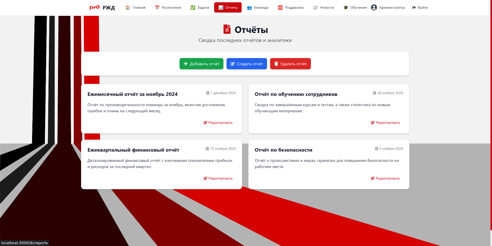
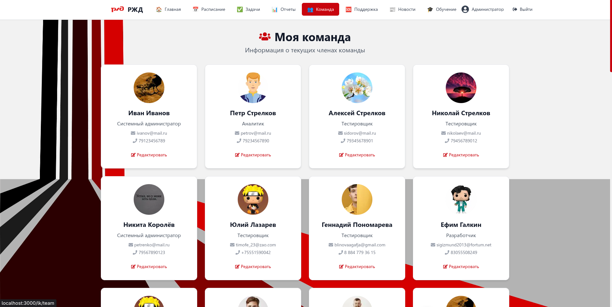
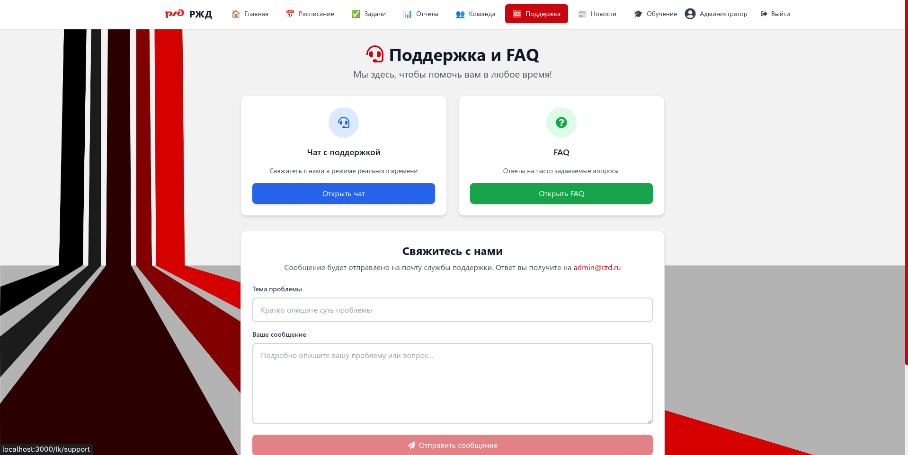
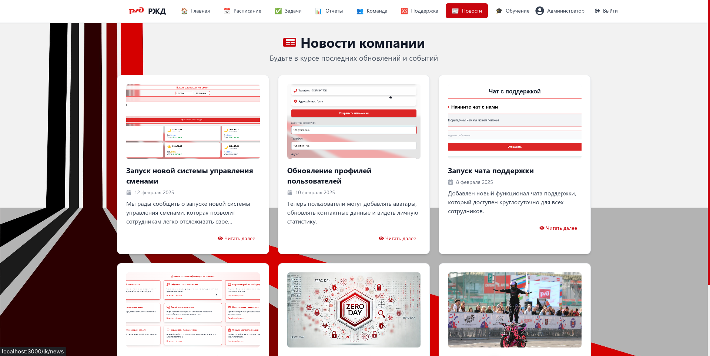
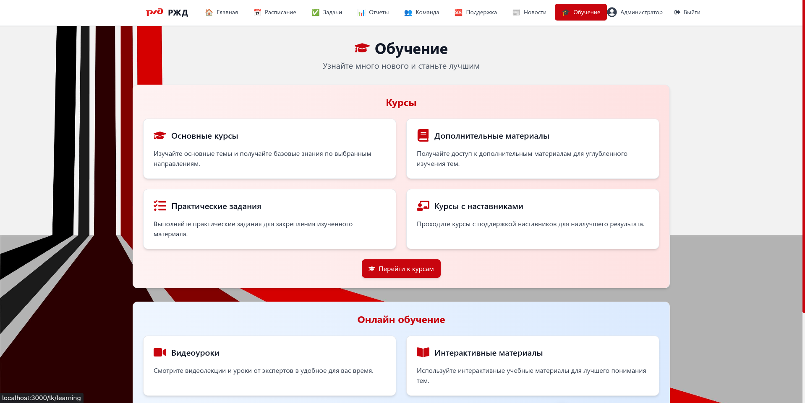
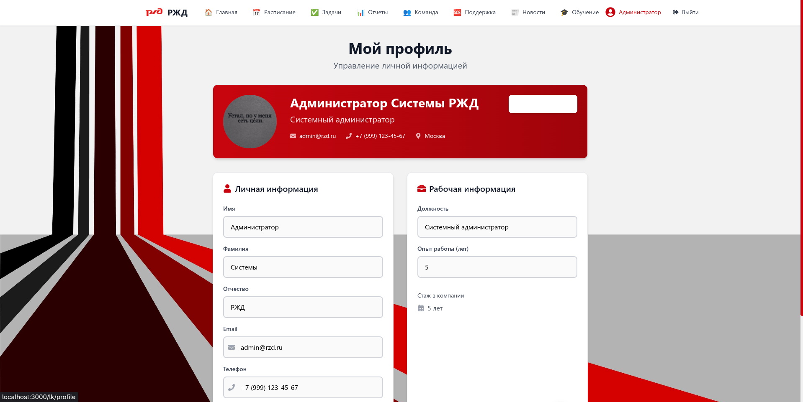

# Система личного кабинета РЖД

Веб-приложение для управления персоналом и рабочими процессами в компании РЖД.

## Технологии

- **Next.js 13** - React фреймворк с App Router
- **TypeScript** - типизированный JavaScript
- **Prisma** - ORM для работы с базой данных
- **SQLite** - база данных
- **Tailwind CSS** - стилизация
- **bcryptjs** - хеширование паролей
- **GO**

## Функциональность

- 🔐 Система аутентификации с хешированием паролей
- 👤 Личный кабинет сотрудника
- 📅 Управление расписанием и сменами
- ✅ Система задач и отчетов
- 👥 Управление командами
- 📚 Обучение и курсы
- 📢 Уведомления
- 🎨 Современный UI/UX

## Установка и запуск

1. **Клонируйте репозиторий:**
```bash
git clone <repository-url>
cd rzd
```

2. **Запуск проекта**
```
docker-compose up --build
```

3. **Открытие в браузере:**
Перейдите по адресу [http://localhost:3000](http://localhost:3000)

## Тестовые данные

После выполнения `npm run db:seed` будет создан тестовый пользователь:
- **Логин:** admin
- **Пароль:** admin123

## Безопасность

- Пароли хешируются с помощью bcrypt
- Используются HTTP-only cookies для сессий
- Middleware защищает приватные маршруты
- Валидация данных на сервере


## 🧭 Скриншоты интерфейса

Ниже представлены скриншоты основных экранов портала.

---

### 🔐 1. Авторизация


---

### 🏠 2. Главная страница


---

### 📅 3. Расписание


---

### ✅ 4. Задачи


---

### 📊 5. Отчёты


---

### 👥 6. Команда


---

### 🆘 7. Поддержка


---

### 📰 8. Новости


---

### 🎓 9. Обучение


---

### 👤 10. Профиль / Выход



## Роли ИС
- *worker*: Базовый уровень. Видит только свои данные, расписание и расчетный листок.
- *brigadier*: Имеет доступ к списку своей бригады. Может подтверждать выполнение работ или отмечать явку.
- *dispatcher*: Ключевая роль для РЖД. У него должен быть доступ к управлению сменами, локомотивами или путями.
- *hr*: Работает с личными делами, отпусками и квалификацией всех сотрудников, но не вмешивается в оперативное управление движением.
- *admin*: Техническая роль для управления доступами и просмотра системных логов. (Полный доступ к ИС)

## Лицензия
MIT License (с уточнением об использовании бренда РЖД)

Copyright (c) 2025 Render

Настоящий проект создан исключительно в учебных и демонстрационных целях.
Он не является официальным продуктом, связанным с ПАО "РЖД" или его дочерними организациями.

Разрешается свободно использовать, копировать, изменять, объединять, публиковать,
распространять, сублицензировать и/или продавать копии данного программного обеспечения,
при соблюдении следующих условий:

1. В приведённой выше заметке об авторских правах и в этом разрешении
   должно сохраняться упоминание об авторе — Render.
2. Использование логотипа, фирменного стиля и товарных знаков ПАО "РЖД"
   допускается только в некоммерческих и учебных целях.
3. Автор не несёт ответственности за любое использование кода,
   связанное с нарушением авторских прав или товарных знаков третьих лиц.

Программное обеспечение предоставляется «как есть» (AS IS),
без каких-либо гарантий, явных или подразумеваемых,
включая, но не ограничиваясь, гарантии товарной пригодности
или пригодности для определённой цели.
Автор ни при каких обстоятельствах не несёт ответственности
по любым претензиям, убыткам или другим обязательствам,
возникающим из использования программы.

© 2025 — Демо-проект интерфейса РЖД  
Разработчик: **Render**